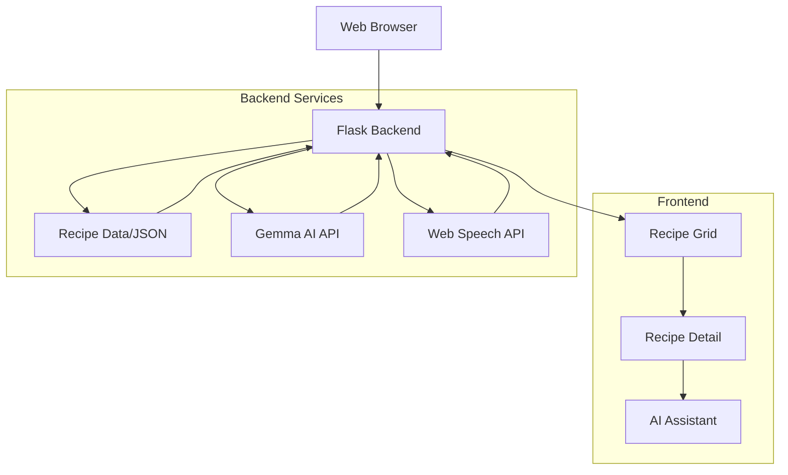

# Kitchen Assistant Web Application

## Table of Contents
- [Recipe Component Analysis](#recipe-component-analysis)
  - [Data Architecture](#data-architecture)
  - [UI Implementation](#ui-implementation)
  - [Core Functionality](#core-functionality)
  - [Advanced Features](#advanced-features)
  - [Notable Implementation Details](#notable-implementation-details)
- [Project Overview](#project-overview)
- [Features](#features)
- [Technology Stack](#technology-stack)
- [System Architecture](#system-architecture)
- [Setup Instructions](#setup-instructions)
- [Usage Guide](#usage-guide)
- [Gemma AI Integration](#gemma-ai-integration)
- [Running on a Raspberry Pi](#running-on-a-raspberry-pi)
- [Development Guidelines](#development-guidelines)
- [Testing](#testing)
- [Performance Considerations](#performance-considerations)
- [Troubleshooting](#troubleshooting)
- [License](#license)
- [Acknowledgments](#acknowledgments)

## Recipe Component Analysis

### Data Architecture
- Uses a structured JSON format for recipe storage
- Each recipe contains: id, name, ingredients[], instructions[], cook_time, and tags[]
- Sample data shows diverse recipe types (e.g., Italian, Asian, vegetarian options)
- Recipe metadata includes cooking duration and categorization tags

### UI Implementation
- Responsive grid layout using Tailwind CSS
- Recipe cards show:
  * Recipe name
  * Cooking time with icon
  * Color-coded category tags
  * Image placeholder with fallback
- Interactive features:
  * Hover effects (translateY animation)
  * Selection state (blue border for active)
  * Card-based design pattern

### Core Functionality
- Recipe browsing with grid visualization
- Tag-based filtering system
- Search implementation with text and voice input
- Detailed recipe view showing:
  * Full ingredients list
  * Step-by-step instructions
  * Metadata (cook time, servings)
- Responsive mobile and desktop layouts

### Advanced Features
- Voice input integration via Web Speech API
- AI assistant for recipe queries
- Markdown support for formatting
- Error handling and loading states
- Accessibility considerations (ARIA labels)

### Notable Implementation Details
- Event delegation for recipe selection
- State management for filtering and search
- Async data fetching with loading indicators
- Error boundary implementation
- Mobile-first responsive design

### Current Strengths
- Well-structured data model
- Rich UI interactions
- Comprehensive error handling
- Multiple input methods (text/voice)
- Responsive design implementation

### Potential Improvements
- Add image support for recipes
- Implement recipe favorites/saving
- Add user ratings/reviews
- Include ingredient quantity scaling
- Add print-friendly recipe view

The component follows modern web development practices with a focus on user experience and accessibility.

## Project Overview

Kitchen Assistant is a lightweight, responsive web application for searching recipes and getting cooking guidance with AI-powered assistance. Designed to run efficiently on a Raspberry Pi and provide a tablet-friendly interface for use in the kitchen.

The application helps home cooks find recipes, follow cooking instructions, and receive AI-powered cooking advice. Running on a Raspberry Pi makes it an affordable, dedicated kitchen helper that can be accessed from any device on your home network, particularly optimized for tablet use.

## Features

- **Recipe Search**: Find recipes by name, ingredients, or tags
- **Recipe Filtering**: Filter recipes by categories like "vegetarian", "quick", "healthy", etc.
- **Detailed Recipe View**: Step-by-step instructions and ingredient lists
- **AI Cooking Assistant**: Ask for advice on cooking techniques, ingredient substitutions, or recipe modifications
- **Voice Input**: Use voice commands for hands-free operation while cooking
- **Responsive Design**: Optimized for tablet use in the kitchen
- **Lightweight**: Designed to run efficiently on a Raspberry Pi

## Technology Stack

- **Backend**: Python with Flask
- **Frontend**: HTML, CSS, and vanilla JavaScript
- **AI Integration**: Gemma AI API for cooking assistance
- **Data Storage**: JSON file-based recipe storage (upgradable to a database if needed)
- **Voice Recognition**: Web Speech API for voice input

## System Architecture

### Component Overview



### Data Flow

1. Recipe Management:
   - Recipes stored in JSON format
   - Loaded into memory at startup
   - Filtered and searched client-side
   - Updates require server restart

2. User Interactions:
   - Direct text input
   - Voice input via Web Speech API
   - Recipe selection and filtering
   - AI assistant queries

3. AI Integration:
   - Queries processed by Flask backend
   - Sent to Gemma AI API
   - Responses formatted with Markdown
   - Returned to frontend

4. Performance Optimizations:
   - Client-side recipe filtering
   - Lazy loading of recipe details
   - Minimized API calls
   - Efficient state management

## Setup Instructions

### Prerequisites

- Python 3.12 or newer
- Raspberry Pi (recommended: Pi 4 or newer) or any computer running Linux
- Git
- A device with a web browser for accessing the interface (tablet recommended)

### Installation

1. Clone the repository:
   ```
   git clone https://github.com/yourusername/kitchen-assistant.git
   cd kitchen-assistant
   ```

2. Create and activate a virtual environment:
   ```
   python -m venv venv
   source venv/bin/activate  # On Windows: venv\Scripts\activate
   ```

3. Install the required packages:
   ```
   pip install -r backend/requirements.txt
   ```

4. Configure environment variables:
   ```
   cp backend/.env.sample backend/.env
   ```
   Edit the `.env` file and update the values as needed, especially the Gemma AI API key.

### Running the Application

1. Start the Flask application:
   ```
   cd backend
   python app.py
   ```

2. Access the application in your web browser:
   ```
   http://[raspberry-pi-ip-address]:5000
   ```
   Replace `[raspberry-pi-ip-address]` with the actual IP address of your Raspberry Pi.

## Usage Guide

### Finding Recipes

1. Use the search bar at the top to find recipes by name or ingredients
2. Click on filter tags to narrow down results
3. Browse the recipe list in the left panel
4. Click on a recipe to view details

### Using the AI Assistant

1. Select a recipe to view its details
2. Scroll down to the AI Kitchen Assistant section
3. Type a question about the recipe or cooking techniques
4. Alternatively, click the microphone icon to use voice input
5. The AI will provide helpful cooking advice

## Gemma AI Integration

The application uses Gemma AI for the intelligent cooking assistant. To enable this feature:

1. Sign up for an API key at [Gemma AI](https://gemma.ai) (replace with actual URL)
2. Add your API key to the `.env` file
3. Restart the application

Without a valid API key, the AI assistant feature will not function.

## Running on a Raspberry Pi

For optimal performance on a Raspberry Pi:

1. Use a Raspberry Pi 4 with at least 2GB RAM
2. Consider using a cooling solution if running for extended periods
3. For startup at boot, add to systemd:
   ```
   sudo nano /etc/systemd/system/kitchen-assistant.service
   ```
   Add the following content:
   ```
   [Unit]
   Description=Kitchen Assistant Web App
   After=network.target

   [Service]
   User=pi
   WorkingDirectory=/home/pi/kitchen-assistant/backend
   ExecStart=/home/pi/kitchen-assistant/venv/bin/python app.py
   Restart=always

   [Install]
   WantedBy=multi-user.target
   ```
   Then enable and start the service:
   ```
   sudo systemctl enable kitchen-assistant
   sudo systemctl start kitchen-assistant
   ```

4. Consider setting up a fixed IP address for easier access

## Development Guidelines

### Directory Structure

- `/backend` - Flask application, API endpoints, and recipe data
- `/backend/static` - Static assets for the frontend
- `/backend/templates` - HTML templates
- `/backend/recipes.json` - Recipe data

### Adding New Recipes

To add new recipes, edit the `backend/recipes.json` file following the existing format.

### Modifying the Frontend

The frontend is built with vanilla JavaScript for lightweight performance:
- HTML templates are in `/backend/templates`
- CSS and JavaScript are in `/backend/static`

### API Endpoints

- `GET /api/recipes` - Get all recipes with optional filtering via query parameters
- `GET /api/recipes/<id>` - Get a specific recipe by ID
- `POST /api/assistant` - Send a question to the AI assistant

### Development Setup

1. For frontend development:
   - Edit files in `/backend/static/js` and `/backend/templates`
   - No build step required - changes are immediately reflected
   - Use browser dev tools for debugging

2. For backend development:
   - Flask debug mode can be enabled in development
   - Set `FLASK_ENV=development` in .env file
   - Auto-reload is supported for Python files

### Testing

1. Manual Testing:
   - Test recipe search with various queries
   - Verify voice input in different browsers
   - Check responsive design on various devices
   - Validate AI assistant responses

2. Browser Compatibility:
   - Tested on latest versions of Chrome, Firefox, Safari
   - Voice input requires compatible browser
   - Mobile browsers supported (iOS Safari, Android Chrome)

### Performance Considerations

1. Recipe Loading:
   - JSON data is loaded once at startup
   - Client-side filtering for quick response
   - Pagination implemented for large recipe sets

2. Resource Usage:
   - Minimal RAM footprint for Raspberry Pi
   - Efficient client-side JavaScript
   - Optimized for mobile devices

## Troubleshooting

### Common Issues and Solutions

1. Voice Input Not Working
   - Ensure your browser supports the Web Speech API
   - Check that your microphone is properly connected and has permissions
   - Try using Chrome or Edge for best compatibility
   - Verify no other applications are using the microphone

2. AI Assistant Not Responding
   - Verify your Gemma AI API key in the .env file
   - Check your internet connection
   - Look for error messages in the terminal running the Flask application
   - Ensure you're not exceeding API rate limits

3. Recipe Search Issues
   - Clear your browser cache
   - Verify the recipes.json file is properly formatted
   - Check browser console for JavaScript errors
   - Ensure the search query isn't too specific

4. Performance Issues on Raspberry Pi
   - Check CPU usage with 'top' command
   - Monitor temperature with 'vcgencmd measure_temp'
   - Consider reducing the number of concurrent users
   - Verify no unnecessary services are running

5. Mobile Display Problems
   - Ensure your browser is up to date
   - Clear browser cache and reload
   - Check if JavaScript is enabled
   - Verify the viewport meta tag is present

6. Server Connection Issues
   - Verify the Raspberry Pi is on the same network
   - Check if the correct port (5000) is open
   - Ensure no firewall is blocking the connection
   - Verify the service is running with 'systemctl status kitchen-assistant'

For additional support, please check the GitHub issues page or create a new issue.

## License

This project is licensed under the MIT License - see the LICENSE file for details.

## Acknowledgments

- Recipe data is fictional and provided for demonstration purposes
- Built with accessibility and sustainability in mind
